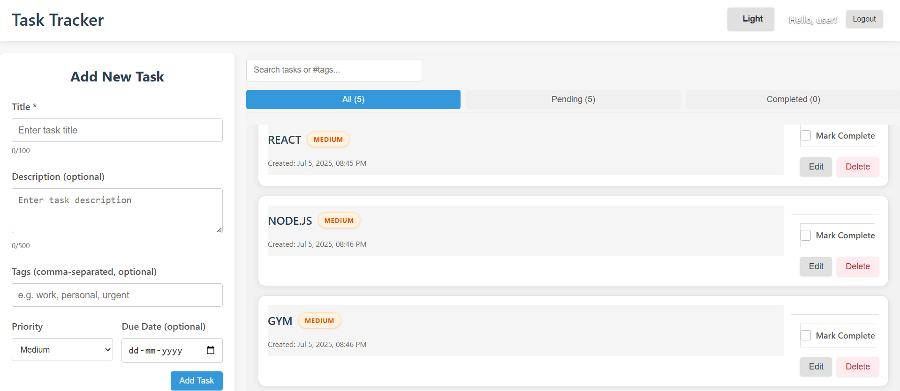
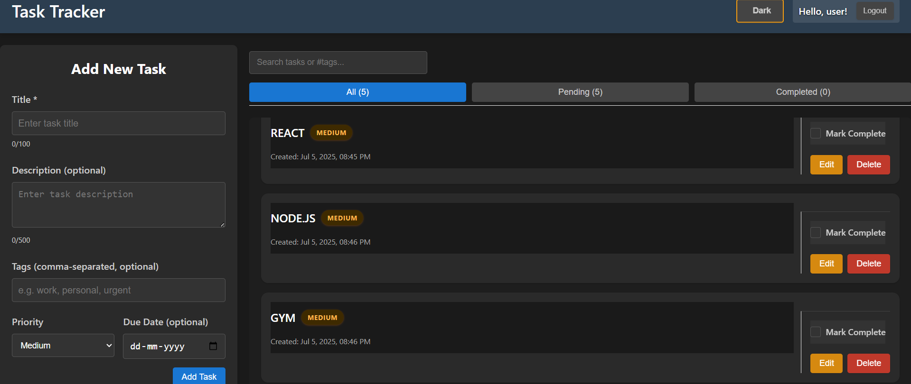
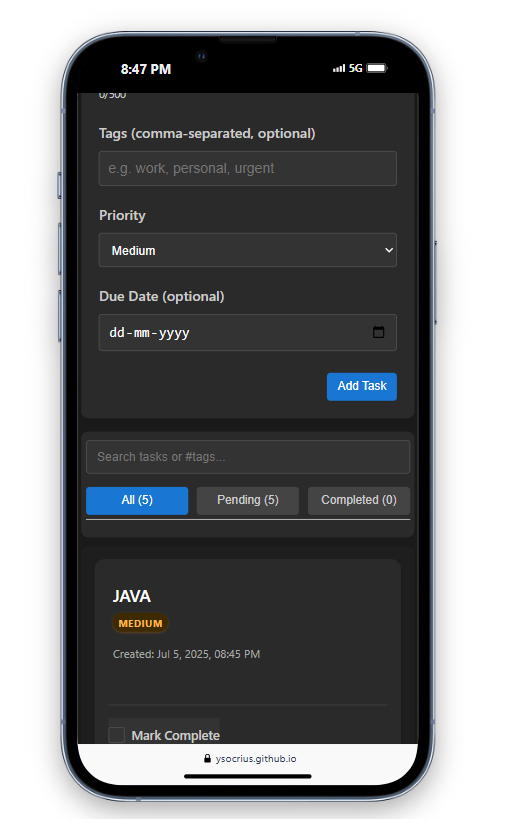

# Personal Task Tracker

A responsive React application for managing personal tasks with a user-friendly interface and modern design.

## 📝 Overview

This task tracker application allows users to:
- Log in with a username
- Create, read, update, and delete tasks
- Filter tasks by status (All, Completed, Pending)
- Search tasks by title, description, or tags using the #tag syntax
- Track task completion status
- Manage tasks with a convenient two-column layout (form and task list)
- Enjoy a fully responsive experience on both desktop and mobile devices
- Access bonus features like task priority levels, due dates, animations/transitions, and dark mode

## ✨ Features

### Core Features
- **Basic login form with a username input**: The application has a login form with username input field
- **Store username in localStorage**: Username is stored in localStorage upon login
- **Redirect to task dashboard after login**: User is redirected to task dashboard after successful login
- **Add Task form with title (required) and description (optional)**: Form for adding tasks with required title and optional description
- **Edit Task inline or via modal**: Tasks can be edited by clicking edit button
- **Delete Task with confirmation prompt**: Tasks can be deleted with confirmation dialog
- **Toggle Complete/Pending status**: Tasks can be marked as completed or pending via checkbox
- **Show task title, description, and completion status**: Tasks display title, description, and completion status
- **Display creation date/time**: Tasks show creation date and time
- **Visual distinction between completed and pending tasks**: Completed tasks have visual distinction from pending tasks
- **Tabs or buttons for All, Completed, and Pending filters**: Filter tabs/buttons for All, Completed, and Pending
- **Show task count for each filter**: Each filter shows the count of tasks in that category
- **Use localStorage to save tasks**: Tasks are saved to localStorage
- **Tasks persist after page refresh**: Tasks remain available after page refresh

### Bonus Features
- **Enhanced two-column layout**: Fixed form on the left with scrollable task list on the right
- **Advanced search functionality**: 
  - Regular search through title, description, and tags
  - Tag-specific search using `#tag` syntax
- **Task priority levels**: Tasks have priority levels (low, medium, high) with color indicators
- **Due dates for tasks**: Tasks can have due dates with approaching/overdue visual indicators
- **Smooth animations/transitions**: UI includes smooth animations and transitions
- **Dark mode toggle**: App has toggleable dark mode with theme persistence
- **Task tags/categories**: Tasks can be tagged and filtered by tags
- **Fully responsive design**: Optimized for all device sizes with intelligent layout adaptations

## 🛠️ Project Structure

```
task-tracker/
│
├── public/
│   ├── index.html
│   └── favicon.ico
│
├── src/
│   ├── components/
│   │   ├── EdgeCaseChecklist.js     # Edge case testing utility
│   │   ├── ErrorMessage.js          # Error message display component
│   │   ├── Login.js                 # Login form component
│   │   ├── Navbar.js                # Navigation bar component
│   │   ├── RequirementsChecker.js   # Requirements verification component
│   │   ├── SearchBar.js             # Search functionality component with tag search
│   │   ├── TaskForm.js              # Task creation/editing form
│   │   ├── TaskItem.js              # Individual task component
│   │   ├── TaskList.js              # Task listing component
│   │   └── ThemeToggle.js           # Dark/light theme toggle
│   │
│   ├── context/
│   │   └── ThemeContext.js          # Theme context for dark/light mode
│   │
│   ├── styles/
│   │   ├── animations.css           # Animation definitions
│   │   ├── buttons.css              # Button styling
│   │   ├── darkMode.css             # Dark mode styles
│   │   ├── filterButtons.css        # Filter button styling
│   │   ├── lightMode.css            # Light mode styles
│   │   ├── Navbar.css               # Navbar styling
│   │   ├── SearchBar.css            # Search bar styling
│   │   └── taskActions.css          # Task action styling
│   │
│   ├── utils/
│   │   ├── dateUtils.js             # Date formatting utilities
│   │   ├── edgeCaseChecks.js        # Edge case validation utilities
│   │   ├── localStorage.js          # LocalStorage interaction utilities
│   │   └── validation.js            # Input validation utilities
│   │
│   ├── App.css                      # Main application styles
│   ├── App.js                       # Main application component
│   └── index.js                     # Application entry point
│
├── package.json                     # Dependencies and scripts
└── README.md                        # This file
```

## 💻 Technologies Used

- **React**: Functional components with hooks for state management
- **React Router**: For navigation between login and task dashboard
- **Context API**: For theme management and global state
- **CSS**: Custom styling with dark mode support
- **localStorage**: For data persistence
- **React Icons**: For UI icons
- **Date-FNS**: For date manipulation and formatting

## 🚀 Getting Started

### Prerequisites

- Node.js (v14.0.0 or higher)
- npm (v6.0.0 or higher)

### Installation

1. Clone the repository
```bash
git clone https://github.com/ysocrius/task-tracker.git
```

2. Navigate to the project directory
```bash
cd task-tracker
```

3. Install dependencies
```bash
npm install
```

4. Start the development server
```bash
npm start
```

5. Open your browser and visit `http://localhost:3000`

## 🧪 Edge Case Handling

The application includes comprehensive edge case handling:

- **Input Validation**: All forms validate input to prevent invalid data
- **Empty States**: Proper UI feedback when there are no tasks
- **Error Handling**: Graceful handling of localStorage errors
- **Mobile Responsiveness**: UI adapts to different screen sizes
- **Long Content**: Properly handles long task titles and descriptions
- **Data Persistence**: Fallbacks if localStorage is unavailable
- **Theme Persistence**: Dark/light mode preference is saved across sessions

## 📱 Responsive Design

The application is fully responsive and provides an optimal experience across:
- Desktop computers (two-column layout)
- Tablets (adaptive layout based on screen width)
- Mobile phones (stacked layout with optimized controls)

## 🔄 User Interface Improvements

- **Two-column layout**: Fixed task form on left, scrollable task list on right
- **Enhanced task cards**: Modern shadow effects, hover states, and visual hierarchy
- **Improved priority badges**: Visually distinct priority indicators
- **Tag system**: Clickable tag badges with filtering capability
- **Advanced search**: Dynamic search with tag filtering using # syntax
- **Theme persistence**: Dark/light mode preference saved between sessions

## 🔍 Search Functionality

- **Global search**: Search through task titles, descriptions, and tags
- **Tag-specific search**: Use `#tag` syntax to filter tasks by specific tag
- **Dynamic results**: Results update as you type
- **Helpful UI hints**: Search tooltip shows how to use tag search

## 🔗 Live Demo

[https://ysocrius.github.io/task-tracker](https://ysocrius.github.io/task-tracker)

## 🖼️ Screenshots






## 🚫 Limitations

- This is a frontend-only application without a backend database
- Authentication is simple and not secure for production use
- LocalStorage has limited capacity (usually ~5MB)

## 🔮 Future Improvements

- Backend integration with proper authentication
- Expanded tag management system
- Collaborative task sharing
- Data export/import functionality
- Push notifications for due dates
- Task attachments and rich text formatting

## 📄 License

MIT License

## 👨‍💻 Author

Yeshwanth C R


